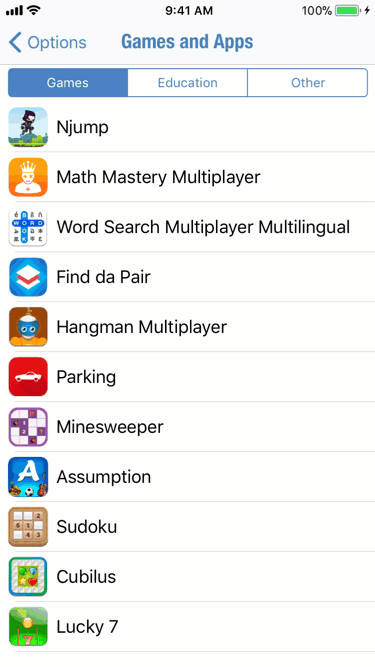
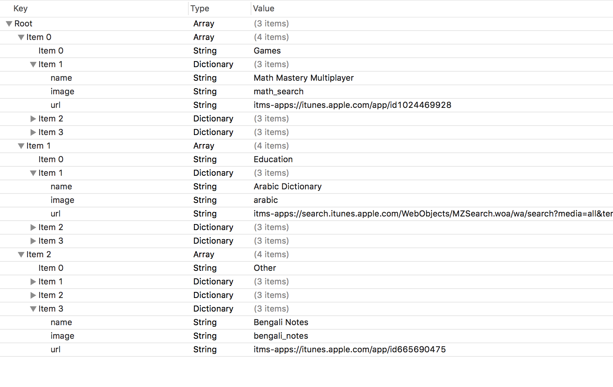

# AppsPortfolio
To showcase multiple apps of a developer for cross promotion. Its an offline way to show user about other apps and it's also possible to know which app users are having more interest. I have been using this UI in all of my iOS apps for cross promoting my other apps. This is a complete project but any improvements are welcome.
<p align="center">
    <a href="https://cocoapods.org/pods/AppsPortfolio">
        
    </a>
    <a href="https://swift.org/package-manager">
        
    </a>
    <a href="https://twitter.com/mahmudahsan">
        
    </a>
</p>

<p align="center">
    
</p>	

## Features

- [X] Showcase apps for cross promotion
- [X] Delegate to integrate analytics to see which app user visits in app store
- [X] Works in both iPhone and iPad


## Examples

Integrate within a UIViewController:
```swift
let bundle = Bundle(for: AppsPortfolioViewController.self)
let appsPortfolioVC = AppsPortfolioViewController(nibName: "AppsPortfolioViewController", bundle: bundle)
appsPortfolioVC.title     = "Portfolio"  //you can give whatever name you like
appsPortfolioVC.loadAppList(name: "sample_portfolio") //provide your custom portfolio plist file name here
self.navigationController?.pushViewController(appsPortfolioVC, animated: true)
```

Implement delegate to inform when user tap an app:
```swift
let bundle = Bundle(for: AppsPortfolioViewController.self)
let appsPortfolioVC = AppsPortfolioViewController(nibName: "AppsPortfolioViewController", bundle: bundle)
appsPortfolioVC.title     = "Portfolio"
appsPortfolioVC.setAnalyticsDelegate(any: self)
appsPortfolioVC.loadAppList(name: "sample_portfolio")
self.navigationController?.pushViewController(appsPortfolioVC, animated: true)
```

One delegate method to get notification:
```swift
extension ViewController : Analytics{
    func appClicked(appNamed: String) {
        print("App: \(appNamed) clicked.")
    }
}
```

sample_portfolio.plist file structure:
<p align="center">
    
</p>

## Usage in an iOS application

Either

- Drag the folders AppsPortfolio/Sources folder into your application's Xcode project. 

or

- Use CocoaPods or the Swift Package manager to include AppsPortfolio as a dependency in your project.

```Ruby
pod 'AppsPortfolio', :git => 'https://github.com/mahmudahsan/AppsPortfolio.git'
```

* In your project create a new **apps_portfolio.plist** file and provide your apps list. Follow the sample_portfolio.plist file format provided in AppsPortfolio/Data.

* In your project add the icons of your cross promoting apps and mention them in your plist file. Better use Images.assets to add apps's icons.

<p align="center">
    
</p>

## Questions or feedback?

Feel free to [open an issue](https://github.com/mahmudahsan/AppsPortfolio/issues/new), or find me [@mahmudahsan on Twitter](https://twitter.com/mahmudahsan).
